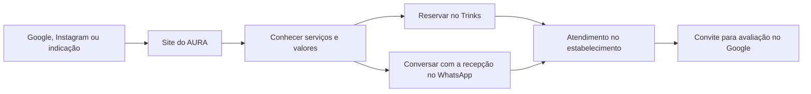

# O AURA: de presença digital a jornada de atendimento

Projeto conduzido por Kevin Dias, com desenvolvimento assistido por IA e validação do responsável junto à equipe do AURA. Registro da entrega em 07/10/2026.

## O problema de negócio

O AURA já tinha presença no Instagram, atendimento pelo WhatsApp, perfil no Google e agendamento pelo Trinks. Faltava uma apresentação própria que organizasse essa experiência: explicar a proposta do estabelecimento, mostrar serviços e levar o visitante ao próximo passo.

O desafio era preservar uma identidade acolhedora, ligada à natureza, em um negócio situado na metrópole, e representar diferentes áreas de serviço sem transformar a página em uma lista desorganizada de procedimentos.

## A solução entregue

Uma página responsiva com verde predominante, tons de creme e marrom, fotografias reais e logo do estabelecimento. A navegação reúne conceito, áreas de cuidado, uma seleção de serviços e preços, experiência, localização e dúvidas frequentes.

O catálogo tem 18 opções e filtros por área. Valores que dependem do serviço mantêm a expressão “a partir de”. Os dois combos de quiropraxia custam R$ 189,90 cada, conforme confirmação do responsável. O catálogo completo e a disponibilidade ficam no Trinks.

O diagrama descreve a jornada pretendida. Ele não representa rastreamento automático nem prova de aquisição de clientes.

## Decisões e seus motivos

| Decisão | Motivo | Limite assumido |
|---|---|---|
| HTML, CSS e JavaScript nativos | A entrega atual cabe em um site estático, com poucas dependências | O HTML principal é montado no navegador e depende de JavaScript |
| Componentes como funções | Reutilizar navegação, perguntas e chamadas para ação | São funções que retornam texto HTML; não há React ou DOM virtual |
| Trinks como destino da reserva | Aproveitar a agenda já operada pela equipe | Link de agendamento não é integração por API |
| WhatsApp como alternativa | Permitir orientação humana pela recepção | O visitante precisa enviar a mensagem e aguardar resposta |
| Fotografias reais | Dar contexto visual do estabelecimento | As imagens disponíveis têm resolução limitada |
| Avaliações no Google | Conduzir a relatos existentes e à plaqueta já usada | Não foram copiados nem inventados depoimentos |
| Campanhas em módulos | Preparar reaproveitamento de estrutura | As oito rotas são conceitos; não são promoções ativas |

## O que este case demonstra no portfólio

Levantamento de requisitos, tradução de identidade em interface, organização de informações, componentes reutilizáveis, eventos de interface, filtros, validação de formulário, preparação de mensagens e ligação entre plataformas já utilizadas pelo negócio.

A participação de Kevin envolve contexto do negócio, direcionamento do produto e validação da entrega com apoio de IA. O repositório e a trilha técnica permitem estudar, modificar e assumir progressivamente a manutenção. Não se atribuem experiência profissional, formação ou autoria exclusivamente manual que não tenham sido demonstradas.

## Resultados verificáveis e resultados a medir

Entregas verificáveis: site publicado, catálogo com filtros, links de reserva, formulário de contato, endereço e horário apresentados e conteúdo organizado. Foram conferidos o filtro de quiropraxia, o diálogo de agendamento e o encaixe da página em tela móvel.

Ainda não medidos: aumento de reservas, faturamento, taxa de conversão, custo por lead e retenção. Essas métricas dependem da operação, de tráfego e de uma rotina de mensuração. Não há promessa de posição no Google nem de resultado financeiro.

## Evolução possível

Melhorar fotografias originais; disponibilizar conteúdo principal em HTML antes do JavaScript; revisar indexação quando for a hora de divulgar; validar uma integração autorizada com o Trinks se houver necessidade real e acesso; implementar mensuração adequada. Cada etapa depende de necessidade e escopo próprios.
